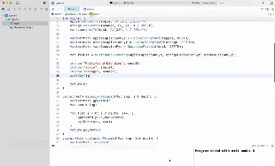

# Multiband image blending
## description
apple image에 대한 Laplacian pyramid, orange image에 대한 Laplacian pyramid를 만들고, 각각의 band를 합성.  
band를 합성하기 위한 mask 영상은 원본 mask 영상의 gaussian pyramid를 생성하여 사용.  

## details
- apple(i): apple 영상의 i번째 Laplacian band
- orange(i): orange 영상의 i번째 Laplacian band
- mask(i): mask의 i번째 gaussian band
`result(i) = mask(i) * apple(i) + (1 - mask(i)) * orange(i))`  
결과로 나온 Laplacian pyramid를 reconstruction

## demo video

